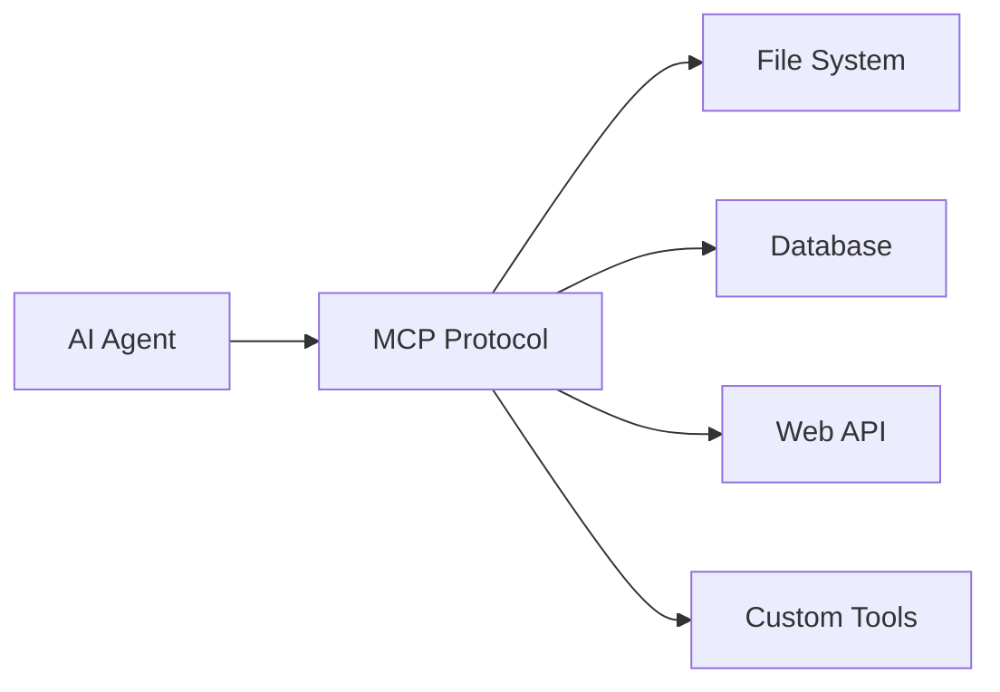
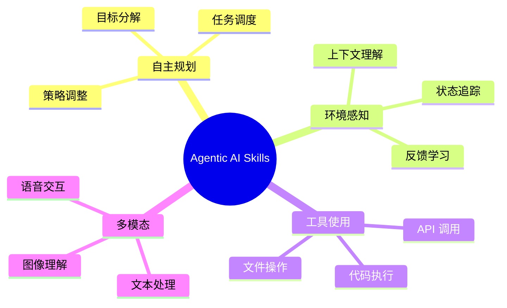

# 🤖 AI 领域的 "Skill" 技术解读

> 最近 AI 领域的 "Skill"（技能）概念正在引领新的技术浪潮，特别是在 **Agentic AI**（智能体 AI）和 **工具调用协议** 领域。本文将为你全面介绍这一热门话题。

---

## 📌 什么是 AI Skill？

在 AI 领域，**Skill**（技能）指的是 AI 系统能够执行的 **具体能力或功能模块**。它可以是：

- 调用特定 API 或外部工具
- 执行复杂的推理和规划任务
- 与外部系统进行交互
- 处理多模态输入（文本、图像、语音）

---

## 🔥 2024年最火的 AI Skill 技术

### 1. MCP (Model Context Protocol) - "AI 的 USB-C"

MCP 由 **Anthropic** 于 2024年11月推出，被誉为 **AI 领域的 USB-C 接口**。

| 特性 | 说明 |
|------|------|
| **标准化接口** | 提供统一的工具调用、数据获取和执行接口 |
| **按需加载** | 工具按需加载，提高上下文效率 |
| **安全性** | 中间结果默认保留在执行环境中 |
| **广泛支持** | 主流编程语言均有 SDK |



### 2. Agent 工具调用能力

现代 AI Agent 的核心技能包括：

| Skill 类型 | 描述 | 典型应用 |
|-----------|------|----------|
| **代码执行** | 运行代码并返回结果 | 数据分析、自动化 |
| **网络搜索** | 实时获取网络信息 | 信息检索、研究 |
| **文件操作** | 读写本地/云端文件 | 文档处理 |
| **API 集成** | 调用第三方服务 | 业务流程自动化 |
| **多模态处理** | 理解图像、音频、视频 | 内容创作、分析 |

### 3. Agentic AI 的核心能力

2024年 Agentic AI 展现的关键 Skills：



---

## 🛠️ 主流 AI Skill 框架

### 开发框架对比

| 框架 | 特点 | 适用场景 |
|------|------|----------|
| **LangChain** | 工具链集成、丰富生态 | 通用 LLM 应用 |
| **CrewAI** | 角色化 Agent、协作工作流 | 多 Agent 协作 |
| **AutoGen** | 对话驱动、多 Agent | 复杂任务自动化 |
| **Semantic Kernel** | 微软出品、企业级 | 企业应用集成 |

### 低代码/无代码平台

- **Dify** - 开源 AI 应用开发平台
- **Botpress** - 对话式 AI 构建工具
- **AgentGPT** - 自动化 Agent 创建

---

## 📚 AI 能力素养框架

### AI Fluency 模型 (2024)

```
┌─────────────────────────────────────────────────────────┐
│                    AI Fluency 四大能力                    │
├─────────────────────────────────────────────────────────┤
│  Delegation    │  知道何时以及如何将任务委托给 AI          │
│  Description   │  清晰描述需求，有效引导 AI                │
│  Discernment   │  评估 AI 输出的质量和可靠性               │
│  Diligence     │  持续监督和验证 AI 的工作                 │
└─────────────────────────────────────────────────────────┘
```

### 技能层次 (图灵研究所框架)

| 层级 | 角色 | 核心技能 |
|------|------|----------|
| **AI Citizens** | 普通用户 | 理解 AI 能力与风险 |
| **AI Workers** | 受 AI 影响的员工 | 与 AI 协作工作 |
| **AI Professionals** | 数据/AI 专业人员 | 开发和部署 AI |
| **AI Leaders** | 高管决策者 | AI 治理与战略 |

---

## 🚀 未来展望

> **Gartner 预测**：到 2028年，33% 的企业软件将集成 Agentic AI，15% 的日常工作决策将由 AI 自主完成。

### 核心趋势

1. **更强的自主性** - AI Agent 将更少依赖人工干预
2. **协议标准化** - MCP 等协议将成为行业标准
3. **多 Agent 协作** - Agent 间的协同将更加普遍
4. **领域专业化** - 垂直领域的专业 Agent 将大量涌现
5. **伦理与监管** - AI 治理框架将日趋完善

---

## 📖 相关协议与标准

| 协议 | 提出方 | 用途 |
|------|--------|------|
| **MCP** (Model Context Protocol) | Anthropic | Agent 工具调用标准 |
| **A2A** (Agent-to-Agent Protocol) | 行业联盟 | Agent 间通信 |
| **ACP** (Agent Communication Protocol) | 开源社区 | 多 Agent 协作 |
| **ANP** (Agent Network Protocol) | 研究机构 | Agent 网络互联 |

---

## 💡 小结

AI Skill 的概念正在从单一的"模型能力"扩展为完整的 **工具生态系统**。通过 MCP 等标准化协议，AI Agent 能够像人类使用工具一样，灵活调用各种外部服务和资源，实现真正的 **自主智能**。

---

*📅 更新时间: 2024年12月*
